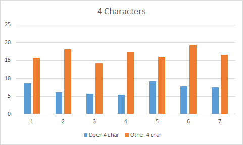

## Preliminary results of the User study
### The Study
We did a comparitive study between our product Dpen and an image recognotion software "Text Fairy" on 12 users. We used  
the Wizard of Oz technique of conducting the user study because of having issues with the classifier.
We performed the tests varying the number of characters a user writes. We started with 4 incrementing the number of charters by 4 for each iteration.The results from the study are shown below.

### Observations
We can see that the time taken to digitize using our device is much smaller for lesser characters .This is because the time taken to make corrections turn out to be less as well as the percentage of errors detected are also lesser.
However as the number of characters increase we can see that the number of corrections keep increasing.A user who is fast at making corrections benefit from our device. Also to be noted that the image recognition app "Text Fairy" is also prone to errors. The error depends upon the handwriting of the user. Eg the user 3 had  a handwriting which was easily classified  and hence the time taken by him while using Text Fairy is lower than the time taken by our product.However in the case of user 4 we can see that the image recongnition software is highly error prone.

### The Final Prototype
Below is the image of our final prototype.

### Conclusion
Our device benefits people who can make faster corrections and whos handwriting is difficult to detect.

